# 분산원장과 블록체인
> http://www.mangoresearch.co/blockchain-vs-distributed-ledger-technology-dlt/

* 상호 신뢰기반 구축 기술
* 위변조 불가
* 어플리케이션 적용 가능
* DLT is Distributed Ledger Technology
* Blockchain was the first fully functional Distributed Ledger Technology
* Blockchain is a type of DLT
* All DLTs are NOT Blockchains. But all Blockchains are DLTs
* Not all the cryptocurrencies are blockchain implementations.
  * Radix, IOTA and R3 Corda are examples of DLTs that are NOT blockchains.
  > 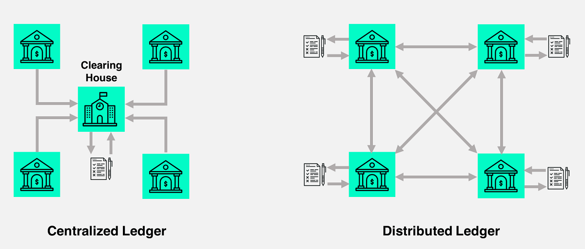

# 비트코인

## 최초의 블록체인

* 1990년대 부터 연구되기 시작
* 비트코인 등장 이전에 HASHCASH, DIGICASH, BIT GOLD, B-MONEY 와 같은 전자/암호 화폐를 시도
* 2007년 부터 시작되어 2008년에 사토시 나카모토에 의해 최초의 블록체인이 개념화
* 사토시 나카모토를 주축으로 오픈소스로 구현된 **비트코인**(original bitcoin client)은 2009-01-03 18:15(UTC)에 제네시스 블록을 시작

## 블록이란?

* 기본정보
  * 블록해시
  * 이전블록해시
  * 머클루트
  * 버전, 타임스탬프, Bits(Difficulty), Nonce
* 기본정보와 검증된 거래정보가 원장에 기록되기 위해 마이너에 의해 블록으로 생성
* 마이너는 높은 수수료를 지불한 거래를 포함하여 기록될 거래를 선택 가능
  * ViaBTC 마이닝풀에서 운영중인 트랜잭션 가속기 - https://pool.viabtc.com/tools/txaccelerator/
    * 무료 또는 유료 서비스가 가능
    * 네트워크에 트랜잭션 정체가 심할 경우 사용 가능
    * ViaBTC 마이닝풀에서 채굴에 성공할 경우, 서비스 수수료를 받고 우선권을 부여하는 방식 (채굴 못하면 도루묵)
* 비트코인 블록 용량은 1MB 로 제한됨 (블록체인마다 제한점이 다름)
  * 용량 제한으로 기록가능한 거래정보도 제한
  * 비트코인의 블록생성 기준인 10분과 용량제한을 가지고 tps(초당 트랜잭션 처리량 [2~4 사이?])를 추정 가능

## 체인이란?

* 모든 블록은 이전블록해시를 기록
* 현재 블록에서 이전블록해시를 계속 찾아가면 제네시스 블록에 도달
* 현재 블록해시는 다음블록의 이전블록해시에 기록되어 연결
  > 

## 시스템 구성

### Genesis Block

* 제네시스 블록은 소스에 하드코딩
* 블록체인 상 #0(첫번째) 마이닝 블록이며 체인의 맨 앞에 위치
* 9년전인 2009-01-03 18:15(UTC) 에 시작
* https://blockchair.com/bitcoin/block/0

### 노드

* 프로젝트의 공식 지갑(Wallet)이 노드에 해당
  * 개인키와 공개키(비트코인 수신 주소) 목록을 관리
  * 거래(트랜잭션)와 블록을 검증하며 직접 생성(마이닝)도 가능
* **P2P 네트워크**의 피어
  * 최초 P2P 네트워크의 접속점은 seed dns 가 소스에 하드코딩
  * Standalone 이나 독립된 피어 네트워크로 구성하면 **독립된** 코인이 제네시스 블록 부터 시작 가능
  * 노드의 실행 옵션에 의해 메인넷, 테스트넷, Standalone 으로 구분하여 구동
* **트랜잭션**, **검증**, **마이닝**
  * 거래에 의해 직접 생성하거나 타 노드에서 전파된 거래를 검증하고 멤풀에 등록, 연결된 피어에 전파
  * 마이닝에 의해 직접 생성하거나 타 노드에서 전파된 블록을 검증하고 로컬 원장에 기록, 연결된 피어에 전파
* 노드의 종류
  * 풀 노드
    * 모든 거래가 담겨 있는 블록체인의 최신 완성본을 보관 (제네시스 블록부터 최신 블록까지)
    * 타 시스템 의존이나 신뢰 없이 모든 거래에 대해 독립적으로 검증
    * 2017년 기준으로 수십기가의 디스크가 필요하고, 최신 블록까지 동기화에 몇일이 소요
  * 라이트웨이트/단술지불검증(SPV) 노드 
    * 스마트폰, 태블릿, 임베디드 시스템 등의 리소스가 제한적인 곳에서 가동되도록 설계
    * 블록 헤더만 다운로드 하며 풀 노드에 비해 1000배 정도 작다
    * 거래 정보가 없기 때문에 풀 노드에서 필요한 정보를 수신하여 동작
      * 연결된 풀 노드가 신뢰 할 수 없다면 취약점이 됨.
  * 채굴 노드
    * 새로운 블록의 생성 여부
    * 전문 채굴 하드웨어는 풀 노드와 연결되어 동작
* 노드 어플리케이션
  * Bitcoin core(C++) - https://github.com/bitcoin/bitcoin
  * Bitcore(Nodejs) - https://github.com/bitpay/bitcore/
  * btcd(Golang) - https://github.com/btcsuite/btcd 
  * 프로토콜만 지키면 누구든지 커스텀 노드 제작이 가능
  * 유틸리티
    * pycoin(Python) - https://github.com/richardkiss/pycoin

### 보상

* 해시파워로 보안성을 증명(PoW)한 마이너에게 코인 보상
* 보상액은 블록당 50BTC 를 시작으로 매 4년마다 50%씩 하향 (**반감기**)
* 총 발행 가능량은 20,999,999.9769개로 고정 (미래에 합의로 조정 가능)
* 총 발행 후 마이너는 거래 수수료 만을 보상으로 획득
* 코인 이코노미
* Projected Bitcoins Long Term - https://en.bitcoin.it/wiki/Controlled_supply#Projected_Bitcoins_Long_Term
  > 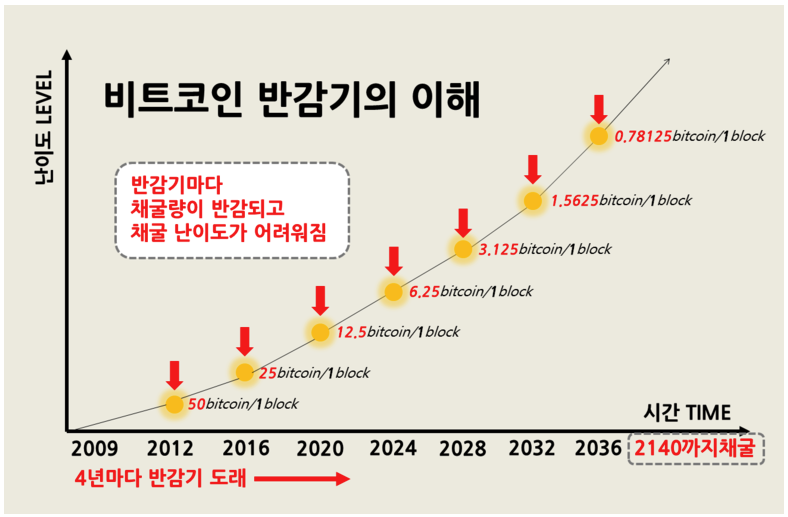

## Proof of Work

* 비트코인의 블록 채굴 방식, "작업증명" 이라고 부름
* 현재도 여전히 비트코인, 이더리움, 비트코인캐시 등 수많은 코인에서 사용
* 가장 검증되고 신뢰된 방식
  > 이론을 바탕으로 현실적으로 오랫동안 해킹없이 운영되며 신뢰도를 쌓음
* 블록의 헤더와 임의의 숫자를 반복적으로 해싱하여 답을 찾아낸 첫번째 채굴자가 승자가 되는 구조
* 각 채굴자는 P2P 네트워크로 부터 새로운 블록을 받게 되면 즉시 새로운 블록으로 PoW 를 재시작
* 무작위 이기 때문에 블록생성 주기는 약간 유동적
* 마이닝의 방법은 CPU > GPU > FGA > ASIC 방식으로 변화 했고, 전력대비 해시레이트를 높이는게 목표
  > 
* 난이도 : 주어진 목표값 아래 해시(블록)를 찾는 것이 얼마나 어려운지를 측정한 값
* 난이도 목표값 : 헤더의 nBits 이며, 네트워크 내의 해싱파워로 약 10분마다 블록을 찾을 수 있는 난이도
  * 최소값 : 1 (시작값이며 제네시스 블록의 헤더 값)
  * 최대값 : 0x00000000FFFF0000000000000000000000000000000000000000000000000000 (상수)
* 난이도 재설정 : 매 2016블록(약 2주) 마다 이전 2016블록의 해싱파워를 기준으로 재계산
  * 이전 2016블록 채굴이 2주보다 빠르면 난이도 상승, 반대면 하락
  > 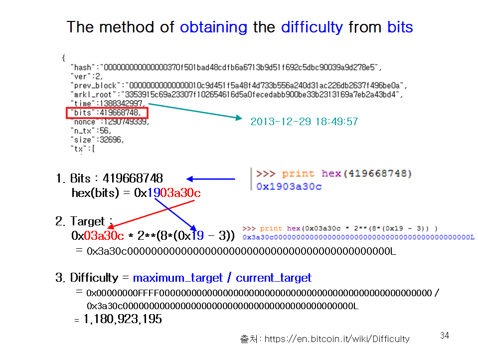
* 그래프상 2곳에서 난이도가 하향 되었는데 해시파워가 가격상승으로 채산성이 높아 졌던 비트코인캐시로 집중되어 일시적 하향된 경우
  > 

## 해싱(블록찾기)

* 해시파워는 파일 용량 단위와 동일한 킬로/메가/기가/테라해시 등의 단위가 존재
* 1메가 해시파워는 초당 1,000,000번의 해싱이 가능
* 해싱
  * 비트코인 네트워크 총 HashRate는 40ExaHashes/s
  * 최강의 비트코인 하드웨어 채굴기 Antminer S9은 대당 14TeraHashes/s
  * S9 1EA 가 네트워크에서 차지하는 비율 > 40/14*1024*1024 = 1/3,000,000
  * S9 300,000EA 10% 비율 가능, 대당 100만원 일때 3천억
  * S9 1,500,000 50% 비율 가능, 1조 5천억
  > 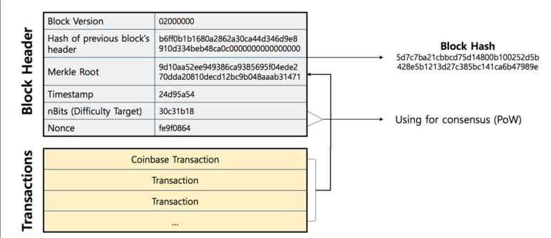
  * 해킹 관련
    * ASIC 하드웨어 수급 불가
    * 51% 는 공격이 가능하다는 것이고 해킹 되었다 라고 보기는 불가

# 비트코인 블록이 만들어지는 과정

## 트랜잭션 (거래)

* 비트코인 주소A 에서 주소B 로 소유권 이전
  * 정확한 부분은 UTXO 에 대해서 알아야 함.
* 발생 노드에서 유효성 검증을 거쳐 네트워크에 브로드캐스팅
* 모든 노드는 트랜잭션이 수신되면 생성과 동일하게 유효성을 검증

## 트랜잭션 풀 (메모리풀)

* 검증된 트랜잭션이 원장에 기록되기 전에 보관되는 곳
* 모든 노드는 블록체인과 마찬가지로 동일한 트랜잭션 풀을 각각 가짐

## 후보 블록

* 이전 블록의 해시와 연결된 유효한 블록 헤더와 바디를 가진 블록
* 채굴자가 해싱을 완료해야 네트워크에 전파 가능한 정식 블록이 됨
* 거래 채우기
  * 코인베이스
    * #0 트랜잭션에 해당하며 채굴 승자가 될 경우 지급 받을 보상을 직접 자신의 비트코인 주소로 송금 하는 것
    * 모든 노드에 의해서 재 검증됨 (주요한 것은 보상 코인 수량)
  * 제한된 블록용량 만큼 트랜잭션 풀에서 블록 바디에 기록 (빈 블록 바디도 가능하나 트랜잭션수수료도 가지기 때문에...)
  * 트랜잭션은 채굴자가 선택 가능하며 트랜잭션수수료는 마이너 몫이기 때문에 높은 값을 우선 선택

## 해싱

* 블록 해답 찾기

## 브로드캐스팅

* 생성/준비된 블록을 네트워크에 브로드캐스팅

## 수신 노드의 역할

* 생성과 동일한 절차로 유효성 검증
* 완료된 해싱 값은 Nonce 에 기록되어 전파 되기 때문에 즉시 모든 유효성 검증 가능

# 코인 인사이드

## 마이닝풀

* PoW 코인은 채굴자가 증가 할 수록 난이도가 증가
* 해시파워가 높을 수록 채굴에 유리 (당연)
* 코인의 난이도에 따라 수십대의 채굴기를 운영해도 하루에 1개의 블록도 채굴하지 못 할 수 있고 시간이 지남에 따라 점차 더 필요 대 수가 늘어남.
* 이에 서비스 업자가 개인들의 채굴기를 그룹화(논리적)하여 해시파워를 높여 채굴 가능성을 높이기 위해 만들어진 것이 **마이닝 풀**
* 개인들에게 해싱 구역을 나누어 주고 채굴에 성공할 경우 수수료를 제외한 보상을 투입지분 만큼 나누는 방식
* 일반적으로 수수료는 1~2% 수준
  > 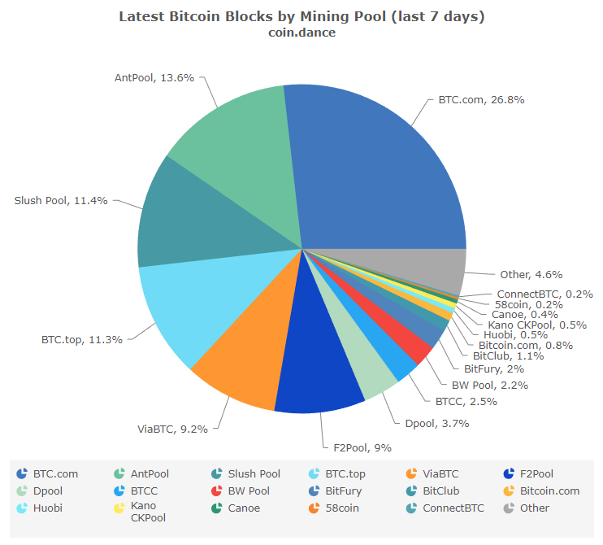

## Address
  > 
 * Bitcoin QR Code Generator - https://gobitcoin.io/tools/qrcode/
  > 

## Wallet
 * 가장 단순하게는 비밀키 1개
   * 하지만 공개적으로 노출되어 입금도 받아야 하기에 비밀키에 대응되는 공개키(실제로는 주소)와 쌍으로 존재
   * 공개키는 비밀키만 있으면 동일하게 생성 가능
   * 단지, 연산 과정을 없애고 미리 생성해 두는 것 일 뿐
  > 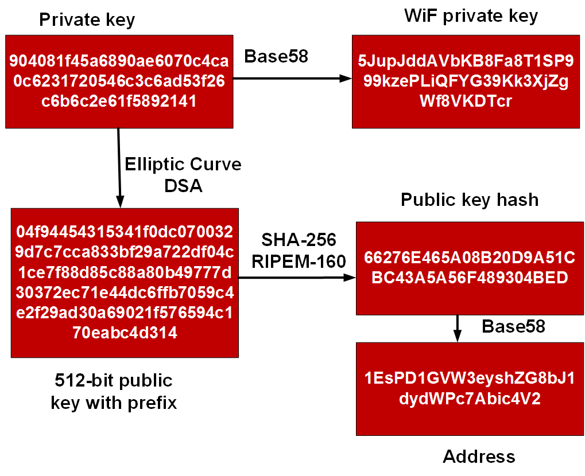
 * 이러한 비밀키, 공개키 쌍이 여러개 존재 하는 것
 * 거래소 등의 지갑에는 이런 비밀키, 공개키 쌍이 수천 ~ 수천만개를 고객과 매핑하여 관리
  > 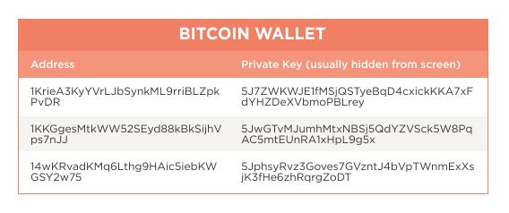
  > 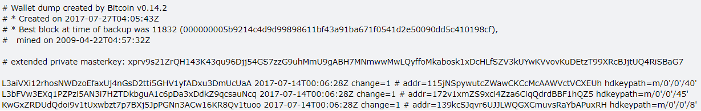

### Hot Wallet
 * 온라인에 접속되어 언제든지 입/출금이 가능한 상태의 지갑
 * 필요한 유동성 만큼만 보관

### Cold Wallet
 * 기본적으로는 오프라인 상태로 입/출금이 불가능
 * 별도의 과정을 거쳐 Hot Wallet 에 입금하거나 키 쌍을 추가하여 온라인화, 유동성 주입
 * 종류
   * 하드웨어 지갑
   * 종이 지갑
   * 독자 구축 솔루션
     * 생체 인식 연동
     * 접근 레벨에 따라 정해진 단위의 출금정보 제공
     * 노드를 이용해서 입맛대로 구축 가능

### Hardware Wallet
  > 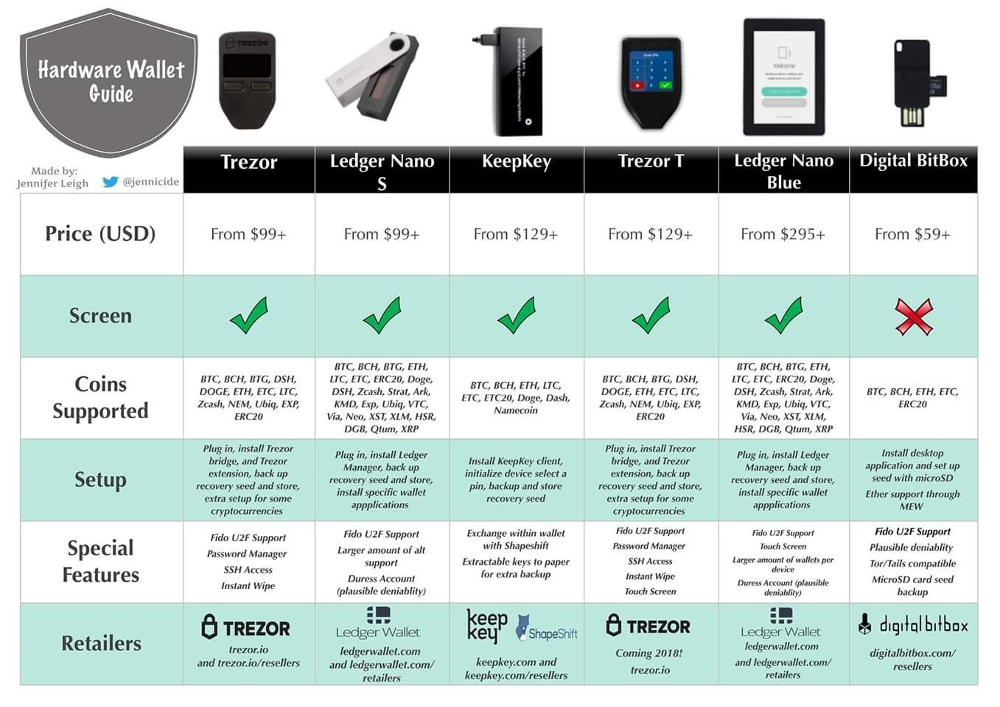
 
## Paper Wallet
 * 비밀키와 공개키를 종이에 인쇄하고 자르고 접어서 물리적 지갑 형태로 만들어 공개키만 보이도록 하는 방식
  > 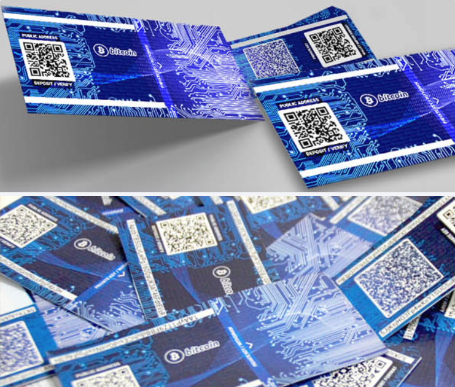

 * 코인의 보안
   * 코인은 비밀키를 사용하여 소비가 되므로 분실하면 복구 불가
   * 비밀키 소지자 모두 소비가 가능하므로 유출 또는 해킹되어 소비되면 복구(?) 불가

 * 비밀키의 보관
   * 비밀키를 보관하는 가장 안전한 방법은 **기억** 이지만 인간의 단점이자 장점인 **기억력**의 한계로 인해 불가능
     > **> 인쇄**
   * 비밀키를 텍스트 파일로 보관
     * 디지털은 기본적으로 보안설비와 전문지식이 없으면 **취약**, 유출 가능성이 있음
   * 파일을 단순 암호화 또는 BIP38 암호화로 보관 (사용시 암호 입력 필요)
     * 사전에 있는 단순한 단어나 짧은 단어는 **대입 공격** 으로 해독 가능성이 있음
     * 해독 가능성 대응을 위해 어렵고 긴 문자, 숫자, 특수문자의 조합은 기억하기 어려워 별도로 기록 해야함.
       > **> 인쇄**
     * 단순 암호화와 BIP38의 차이는 사용 편의성을 위해 클라이언트의 지원여부
   * 하드웨어 지갑
     * 고장 가능성이 있음
     * Seed 복원 모드로 여러개로 복제하여 고장 대응 가능
     * 동시 고장 가능성이 있음 (몇개를 복제 할 것인가?)
     * 복원을 위해서 Seed(mnemonic words)를 별도 보관
       > 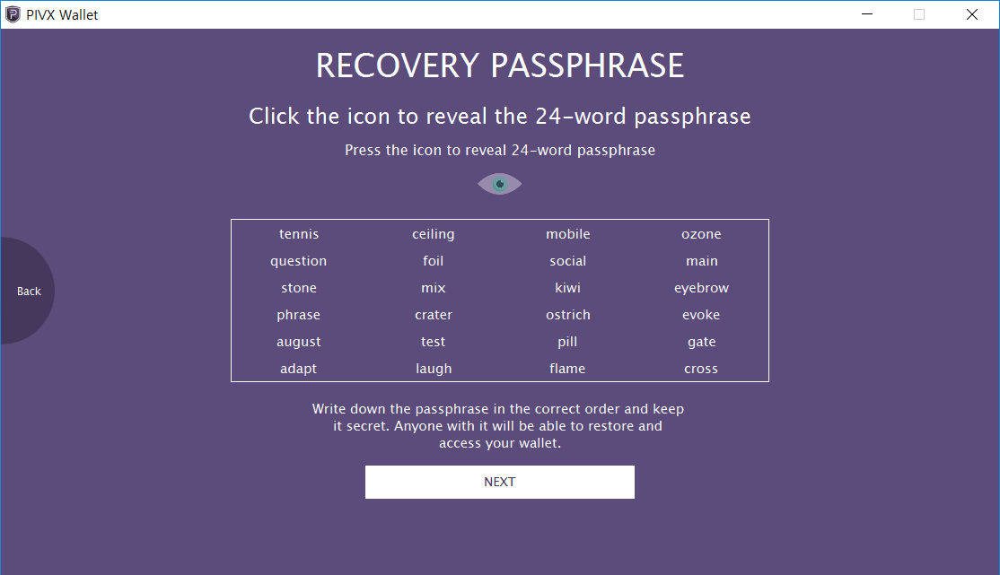
     * 어차피
       > **> 인쇄**

 * 인쇄
   * 가장 안전한 보관 방법
   * 인쇄된 종이지갑(BIP38 적용가능)을 금고에 보관
     * 내화금고
     * 은행금고
     * 복사하여 여러 지역에 분산
   * 10,000개(천억상당)의 비트코인을 100개(십억상당) 단위로 종이지갑에 넣어 보관
   * 200개 필요시 종이지갑 2개를 인출하여 사용

 * 서비스
   * 종이 지갑 생성 - https://paperwalletbitcoin.com/?=BTCPW
   * 단순 주소 생성 - https://www.bitaddress.org

### Wallet transfer solution
  > 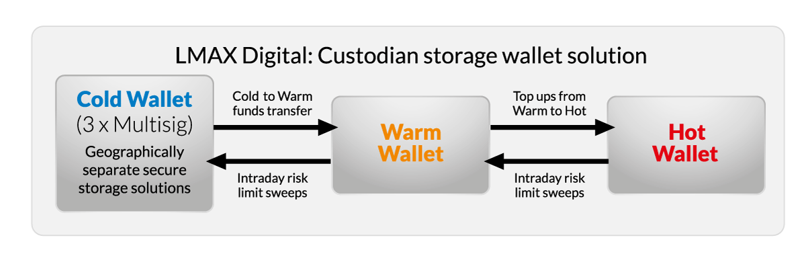

## Vanity(꾸미기) 주소
  > 
 * 리더블한 문자를 포함하는 유효 비트코인 주소
 * 주소의 첫 문자를 **BiTCoiN**으로 구성 (맨 첫자리는 1,3,5 로 고정되어 있음)
 * 무작위로 개인키를 생성하여 공개키 및 비트코인 주소를 생성하고 주소가 원하는 패턴에 맞을 때 까지 반복
 * 꾸미기 주소가 일반 주소와 다른점은 오직 보이는 것
 * 생성 난이도
   > 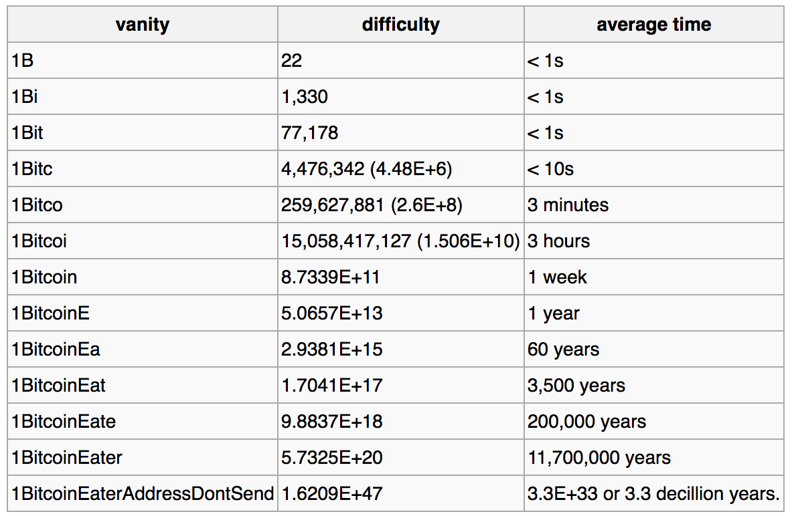
 * 만들어 보기
   * 유틸리티 - https://github.com/samr7/vanitygen
   * **inn** 와 **inno** 로 구성, 각각 5초, 10분 정도 소요
```
[root@gitagy-22671 vanitygen]# ./vanitygen 1inn
Difficulty: 4553521
Pattern: 1inn
Address: 1innFcD634Y1zxf1wx5bwP1KGfX1MKf6L
Privkey: 5KFZiW2tRKtbuchwk8tH2L34q7RiYGR7rF1AucSsDKjRM8uerQf

[root@gitagy-22671 vanitygen]# ./vanitygen 1inno
Difficulty: 264104224
Pattern: 1inno
Address: 1innoh7oS33pXbA9oQrt34qtRM6paWQSB
Privkey: 5JLkvKL2amCaizEefmqwAWXPxyz8MZSZVYrXEKoC8ao7AwJBJ1Y
```
 * Vanity Pool
   * 만약, 기관의 모금용 비트코인 주소를 **saveEarth** 로 구성하고 싶다면
   * CPU 또는 GPU 로 한다고 해도 성능에 따라 수개월 ~ 수백년의 시간이 소요
   * **Vanity Pool** 은 꾸미기 주소 풀에 비용을 주고 외주는 주는 격

## Confirmation
 * 거래(트랜잭션)는 생성 후 즉시 연결된 피어노드에 브로드캐스팅 되어 수초내에 대부분의 노드에서 인식
 * 비트코인 지갑에서는 거래의 **인식**과 **완료**를 별개로 보는데 완료를 위해서는 Confirmation 이 필요
 * 거래가 채굴된 블록에 최초로 포함되면 0 Confirmation, 이 후 추가로 블록이 채굴될 때마다 Confirmation 이 증가
  * Bitcoin transaction confirmation process
    > 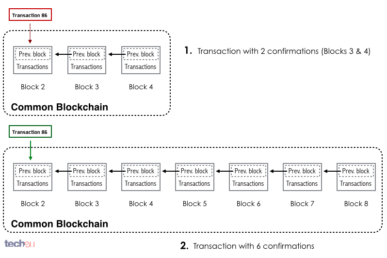
 * 송금된 비트코인이 **입금 완료**되어 수신자에 의해 사용 가능하려면 6 Confirmation(약1시간) 이 필요
 * 6 Confirmation은 비트코인 지갑의 기본 프로토콜이며 거래소등 에서는 1~3 Confirmation 사이에 미리 완료로 처리 하기도 함. (거래소 마다 다름)
 * 송금과 다르게 채굴 보상으로 발행된 비트코인은 100 Confirmation 이 필요

## UTXO
  > 
  > 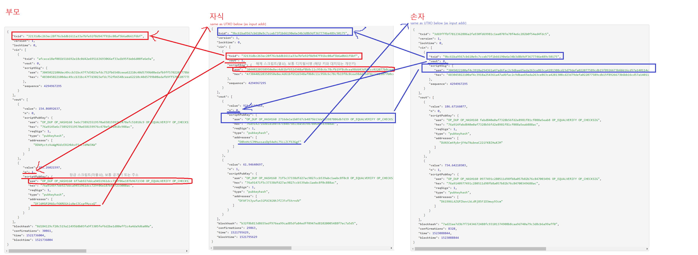
### 잠금 스크립트

### 해제 스크립트

### UTXO Spending(송금)

## Multi-Sig
