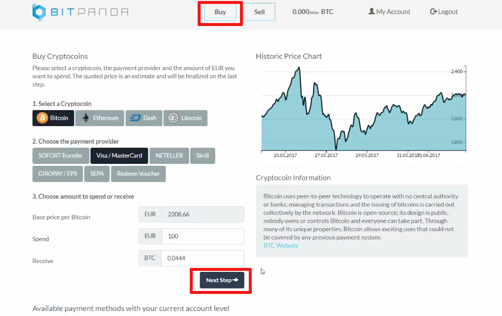

# 기축통화
 * 코인계는 현실계와 다르게 법정화폐 외에 기축통화 역활을 하는 각종 코인들이 존재
 * 간단하게 초기에 비트코인은 각 나라의 법정화폐와 페어링되고 알트코인은 비트코인과 페어링

## 법정화폐
  * 원화
  * 달러
  * 엔화
  * 위안화
  * 유로화
  * 등등

## 스테이블 코인
  > 법정화폐 예치금 만큼의 코인을 발행하여 1:1 비율로 교환이 가능한 코인 
  > 한국은 상대적으로 편리하게 코인 현금화가 가능하여 니즈가 낮음 
  > 미국, 유럽 등 다수의 국가에서는 다소 불편하며 오랜 시간이 걸림 
  > 이러한 문제점을 보완하기 위해 가격 변동성을 낮추고 임시적 현금화 수단으로 사용 
  > USDT/TrueUSD 는 미국 달러에 페깅한 코인, Digix 는 금에 페깅한 코인  
  > 

  * USDT
    * Tether Limited에서 발행, 미국 달러와 1:1 비율로 교환
    * 비트코인 블록체인 이용
    * 전세계 많은 거래소에서 USDT 마켓 지원
    * 하지만 2017년말 대규모 테더 발행과 외부 감사 관련 이슈가 있음
      * 불투명한 운영과 외부 감사 미진행 문제 등이 꾸준히 제기
      * 단순하게 발행량 만큼의 예치금이 진짜로 있나? 의 이슈
  * TUSD (TrueUSD)
    * 테더의 문제점을 해결하고 테더가 독식한 시장에 도전한 코인
    * 미국 달러와 1:1 비율로 교환 보증
    * 보증하는 법정화폐는 에스크로를 통해 위탁 관리되며, 매월 제정 감사를 실시
    * 보유중인 법정화폐의 법적 소유권은 TUSD 토큰 소유권자에게 부여(최초)
    * 이더리움 토큰 형태
    * Binance, Bittrex, UPbit 거래소 등에서 지원
  * Bitshares, Havven, Maker
    * 코인으로 보증
    * $200 가치의 이더리움을 담보로 $100 의 스테이블 코인 발행, 시점 기준 200% 의 담보가치
    * 장점
      * 탈중앙화 된 방식
      * 담보비율 자체가 블록체인상에 공개 될 수밖에 없는 투명성
    * 단점
      * 이더리움 50% 하락까지는 안전하게 보증 가능
      * 복잡성이 높음
  * Digix
    * 보증으로 Gold 를 사용

## 대형 코인
  > 신뢰와 유동성이 뒷받침 되어야 하며, 거의 대부분 아래 두가지 정도를 취급
  * 비트코인
  * 이더리움

## 거래소 코인
  > 거래소 내에서 수수료 등으로 소비하거나 보유시 발생 수수료에서 지분만큼 수익쉐어
  * 바이낸스의 BNB (수수료)
  * 쿠코인의 KCS (배당형 즉, 증권형으로 분류 가능성)
  * 코스의 COSS (수수료 50% 배당)

# 알트코인
  * 비트코인외 모든 후발 주자를 통칭
  * 비트코인 만이 화폐로 거래되던 시절, 대부분의 알트코인은 비트코인을 기축통화로 거래
  * 지금은 이더리움, 리플, 비트코인 캐시 등 대형 코인 몇몇은 비트코인과 같은 레벨로 보는 편임. (주관적)

# 거래소
  > 

## 사전 지식
 * 마켓 = currency pairing
 * 상장 = listing
 * 상폐 = delist

## 거래소의 발전
  * 뉴욕 비트코인 센터 오프라인 거래 (like auction)
    >  
    > 
  * 매수/매도 정보를 게시판에 올려 오더북 처럼 사용
  * 주식에서 사용하는 오더북, 차트, 매칭엔진을 도입하여 비슷한 형태로 발전해 현재 진행 중

## 몇가지 분류
 * 참고로 한국 업비트의 마켓 상황
   > 

### 법정화폐 거래 지원
 * 해당 국가의 규제 현황과 은행과의 업무 체결이 지원 여부에 가장 큰 요소
 * 은행과 법정화폐 입/출금을 전자적으로 연동하여 자동화
 * 최근 국내 신규오픈 거래소들이 은행들의 비협조 상황에서 아래와 같은 절차로 법정화폐 지원
   * 고객이 입금예정 정보를 입력
     * 입금예정일시
     * 입금액
   * 거래소에서 송금시 입금자명에 기입할 코드 출력
     * Ex) **37254**
   * 입금자명에 코드를 넣어 거래소 법인 계좌로 송금
   * 거래소 담당자가(1~n명) 확인 후 입금 처리
 * 법정화폐 페어링 마켓이 별도로 존재하거나 법정화폐만 지원(예를 들어 코인원, 빗썸, 코빗)

### 코인간 거래만 지원
 * 특정 코인을 기축통화로 한 마켓이 형성
 * 마켓에 리스트된 코인은 마켓 기축통화와 페어링
 * 화폐없이 디지털 상품을 거래하는 방식이라 법적 갈등이 적음
   * 한국 빗썸이 해외 진출을 위해 법정화폐 없는 빗썸Pro를 만들었다?
     * 그리고 빗썸에서 빗썸Pro로 아주 쉽게 자산을 이동 할 수 있께 했다. (장부상 이동이라 법적 갈등 소지가 있을지도...)
   * 하지만 어디선가 기축통화 코인을 구매하여 이체해야 거래 가능

### 스테이블 코인을 포함한 코인간 거래만 지원
 * 스테이블 코인을 기축통화로 한 마켓이 형성
 * 블록체인상에서 작동, 1:1 보증 등의 장점을 그대로 활용 가능하며 법정화폐 거래와 유사한 효과
 * 한국외 국가의 거래소에서 대부분 채택하는 방식
   * 최근에는 해당 거래소들도 법정화폐를 추가하기 위해서 고군분투 중

### 마진 거래소
 * 비트멕스는 최대 레버리지 2x~100x
  > 

### 선물 시장
  * CME 시카고선물거래소
  * CBOE 시카고옵션거래소

### 라이센스 거래소
 * Gemini (제미니)
   * 뉴욕금융서비스국(NYSDFS)으로 부터 비트라이센스(BitLicense) 획득
 * ItBit Gets NY Regulatory Approval
   > itBit has received approval from the New York State Department of Financial Services (NYDFS) to add trading in four new cryptocurrencies,
 * 스퀘어
   * 캐시앱을 통한 매매, 비트라이센스 획득

## 국가별 거래소
 * 홍콩 (중국)
   * Binance
   * Huobi
   * OKEx
   * LBank
   * Fex
   * KuCoin
 * 일본
   * Bitflyer
   * Coincheck
   * Zaif
 * 한국
   * bithumb
   * UPbit
   * coinone
   * KORBIT
   * COINNEST
   * Coinrail
   * GOPAX
   * GPDAX
   * komid
   * zeniex
   * 오케이코인 코리아
   * 후오비 코리아
 * 미국
   * GDAX (coinbase)
   * Gemini
   * Poloniex
   * Bittrex
 * 영국
   * Bitfinex (버진아일랜드)
   * HitBTC
   * Bitstamp
 * 유럽
   * Kraken
 * 싱가포르
   * Coinbene
   * COSS
   * BiteBTC
 * 베트남
   * V btc?
 * 태국
   *
 * 인도네시아
   * coinone.co.id
 * 러시아
   * Yobit
 * 기타
   * 케이먼군도 gate.io
   * 세이셸공화국 BitMEX

## 거래량 기준 순위
  * 거래소별로 취급 유형도 있어 순위 변동이 심함.
    > 

## 거래소 마켓 스크린샷
  * [페이지 이동...](ExchangeScreenshot.md)

## 특이한 거래소
  > 쉽게 사고 파는게 목표

 * 쉐이프시프트
   * 코인 스와핑
     >  
   * 지원 코인
     > 
 * Changelly
   * 구매
     >  
     > 
   * 입금 받을 주소
     > 
   * 결제 정보
     > 
 * BITPANDA
   * 구매자 정보
     > 
   * 구매
     > 
   * 결제 방법
     > 
   * 내역 확인
     > 
   * 구매자 추가 정보
     > 
     > 
   * 결제 정보
     > 

## 탈중앙 거래소
  > 중앙 거래소의 해킹 또는 먹튀
  > 규제, 제도가 밑받침 되지 않아 중앙거래소의 만행이 심하다.
  > 탈중앙화를 추구한다면 거래도 탈중앙 해야 한다.
  * 거래소 종류
    * EtherDelta
    * idex
    * 진행중
      * Nex
  * 중앙 거래소에 비해서 사용자경험이 현전히 떨어진다.
    * 구린 인터페이스
    * 체결에 시간이 오래 걸리고, 재사용에도 시간이 걸린다.
    * https://enerchain.ponton.de/index.php/21-enerchain-p2p-trading-project

## OTC 시장
  * LocalBitcoin

## 코인 신규 상장 프로세스
 1. 허울 뿐인 거래소의 코인 분석 및 보고서
    * 빗썸의 보고서 - http://bithumb.cafe/암호화폐-검토보고서
      * [트론 보고서](../data/tron_listing_report.pdf)
 1. 상장 코인 지갑을 거래소 구조에 맞게 커스텀
    * 노드 운영
    * 입/출금 자동화 연동 (SDK 연동 수준)
 1. 입금 및 거래 오픈 일시 공지
 1. 입금 주소 오픈
    * 입금액 기준 미달시 상장 연기
    * 대형 유명 거래소 상장시 단시간에 폭발적 트랜잭션으로 해당 코인 네트워크 정체가 많았음
    * 네트워크 정체 외에도 거래소의 입금처리 프로세스도 지연
 1. 시초가 지정
 1. 거래 오픈
    * 천하제일 단타 대회
    * 거래소 과부하
      * 체결 지연
      * 주문 취소 지연
      * 사이트 마비
        > 총체적 난국
 1. 펌핑과 덤핑 사이
    * 엘프
      > 
    * 미스릴
      > 
    * 질리카
      > 
    * 에이치쉐어
      > 
 1. 거래소간 시세 차익 거래 (재정거래)
    * 폐쇄적 환경, 세력질, 수요와 공급 등 많은 경우의 수가 있겠으나 이때 많은 경우 해외 거래소와 호가차가 발생하였고 재정이익을 노리는 보따리상이 판을 침

# 거래와 수익

## 국내 거래소 상황
 * 빗썸, 업비트, 코인원 3대장에 겨우 코빗이 꼽사리와 나머지 잡거래소
 * 코인네스트 잡알트에 집중해서 급성장 중 대표이사 배임/횡령 관련 구속수사로 나락으로...
 * 중국 글로벌 거래소 한국 런칭 하였으나 장 상황으로 지지부진
   * 후오비 코리아
   * OKEx 코리아
 * 원화마켓
   * 빗썸
   * 업비트
   * 코인원
 * 코인마켓
   * 빗썸프로 (빗썸과 상호 연동은 자산 이동 뿐)
   * 업비트
   * 기타 잡 거래소

## 상승장에서 랠리 순서
  1. 비트코인
  1. 대형알트
     1. 이더리움
     1. 비트코인캐시
     1. 대시
  1. 소형알트

## 코인 발행량에 따른 부각
 * 만원짜리 천만개 발행과 백원짜리 10억개 발행은 시가총액이 같음
 * 지폐(천원)가 되기 전의 코인을 **동전주** 라 부르며 투기 붐이 있었음
 * 투기 붐 때 코인의 구조를 모르며 단순히 저렴한 이유로 높은 수익을 기대하며 매수
    > 

## 투자시 기축통화 비중
 * 40% 법정화폐
 * 60% 코인
   * 70% BTC
   * 15% BCH
   * 15% ETH

## 상승장
 * 비트코인으로 알트코인 매수
 * 알트코인 상승시 비트코인 수량 증가
 * 알트코인 하락과 비트코인 상승시
   * 비율에 따라 다르지만 법정화폐는 유지 됨
 * 알트코인 하락과 비트코인 횡보 또는 하락시
   * 법정화폐 마켓에 판매 > 수익실현

## 하락장
 * 숏 마진 거래
 * BTC 마켓에서 상승할 만한 코인 매수로 BTC 수량 증가

## 봇 거래
 * 대부분의 거래소에서 API로 시세, 오더북, 주문 등을 지원
 * 다양한 거래소를 통합 인터페이스로 지원하는 어플리케이션 또는 서비스도 존재
 * 봇은 어디에나 있고 동일 거래소 내에서도 마켓간 차액을 노림

## 거래소간 시세 차익 거래
  1. B 거래소에 BTC 송금
  1. B 거래소에서 KTL 매수
  1. B > A 거래소로 송금
  1. A 거래소 KTL 매도
  * 입출금에 시간이 걸려 진행 중 시세 변화로 마이너가 될 수 있음
  * 차익 거래에 이용할 해외 거래소에 미리 계정을 만들고 입출금 등급을 올려둬야 함

## 김치 프리미엄 거래
 * 비트코인을 추가 발행할 방법은 채굴 밖에 없으나 국내는 이미 늦음
 * 기존 발행된 비트코인을 국내 거래소로 옮겨 내국인에 판매되어야 함
 * 하지만 외국인이 비트코인 판매 대금을 회수할 방법이 마땅치 않음
 * 높은 수요와 부족한 공급으로 생겨난 프리미엄
   * 국내 거래량과 국내 비트코인 보유량은 다른 문제

## 역 김치 프리미엄의 시대
 * 2017년 6-7월 사이 약 15-20% 정도의 역 김치 프리미엄이 있었음
 * 국내 장이 완전히 패닉되어 나타난 현상
   * 중국 비트코인 거래소 및 ICO 금지
   * 한국내 ICO 금지
     * 실제 법적효력은 없으나 규제적 효과는 거둠

## 김치 프리미엄 차익 거래
 * 2017년 06월 최대 50% 육박
 * 2017년 12월 최대 60% 육박
 * 2018년 06월 현재 1~5% 수준
 * 프로세스
   1. 3% 일 때 비트코인 매수
   1. 해외 거래소 송금
   1. USDT로 판매 (달러화 효과)
   1. 목표한 프리미엄 달성
   1. USDT로 비트코인 매수
   1. 국내 거래소 송금
   1. 법정화폐로 판매
     > 프리미엄 차이 - 수수료 만큼이 수익
