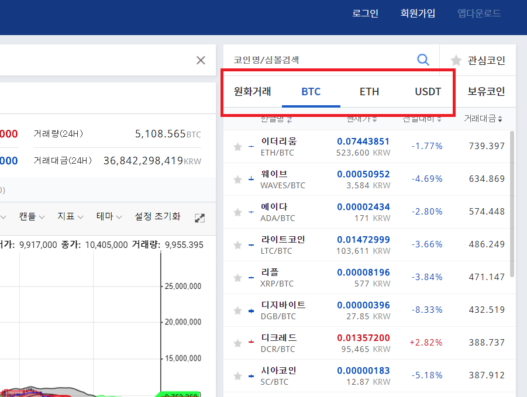
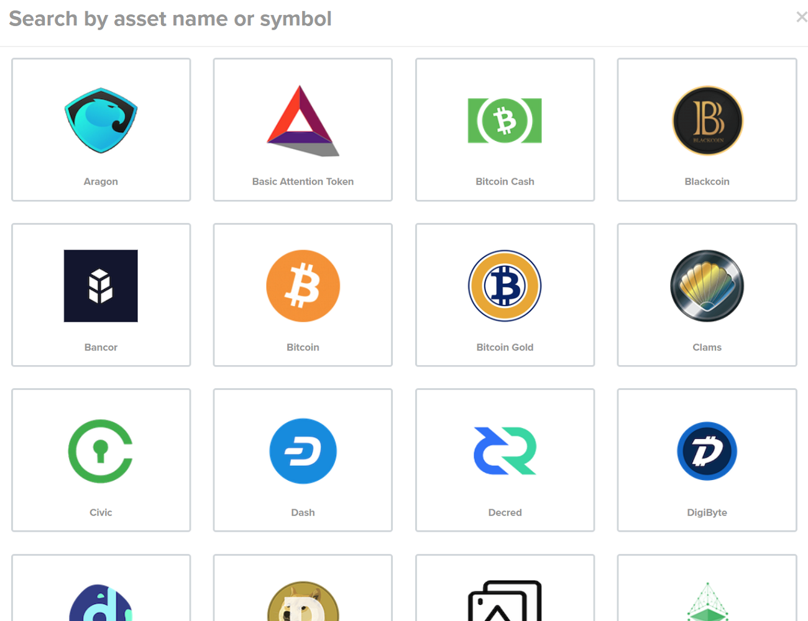

# 기축통화
 * 코인계는 현실계와 다르게 법정화폐 외에 기축통화 역활을 하는 각종 코인들이 존재
 * 간단하게 초기에 비트코인은 각 나라의 법정화폐와 페어링되고 알트코인은 비트코인과 페어링

## 법정화폐
  * 원화
  * 달러
  * 엔화
  * 위안화
  * 유로화
  * 등등

## 스테이블 코인
  > 법정화폐 예치금 만큼의 코인을 발행하여 1:1 비율로 교환이 가능한 코인 
  > 한국은 상대적으로 편리하게 코인을 현금화 가능 
  > 미국, 유럽 등 다수의 국가에서는 다소 불편하며 오랜 시간이 걸림 
  > 이러한 문제점을 보완하기 위해 가격 변동성을 낮추고 임시적 현금화 수단으로 사용
  * USDT
    * Tether Limited에서 발행, 미국 달러와 1:1 비율로 교환
    * 비트코인 블록체인 이용
    * 전세계 많은 거래소에서 USDT 마켓 지원
    * 하지만 2017년말 대규모 테더 발행과 외부 감사 관련 이슈가 있음
      * 불투명한 운영과 외부 감사 미진행 문제 등이 꾸준히 제기
      * 단순하게 발행량 만큼의 예치금이 진짜로 있나? 의 이슈
  * TUSD (TrueUSD)
    * 테더의 문제점을 해결하고 테더가 독식한 시장에 도전한 코인
    * 미국 달러와 1:1 비율로 교환 보증
    * 보증하는 법정화폐는 에스크로를 통해 위탁 관리되며, 매월 제정 감사를 실시
    * 보유중인 법정화폐의 법적 소유권은 TUSD 토큰 소유권자에게 부여(최초)
    * 이더리움 토큰 형태
    * Binance, Bittrex, UPbit 거래소 등에서 지원

## 대형 코인
  > 신뢰와 유동성이 뒷받침 되어야 하며, 거의 대부분 아래 두가지 정도를 취급
  * 비트코인
  * 이더리움

## 거래소 코인
  > 거래소 내에서 수수료 등으로 소비하거나 보유시 발생 수수료에서 지분만큼 수익쉐어
  * 바이낸스의 BNB (수수료)
  * 쿠코인의 KCS (배당형 즉, 증권형으로 분류 가능성)

# 알트코인
  * 비트코인외 모든 후발 주자를 통칭
  * 비트코인 만이 화폐로 거래되던 시절, 대부분의 알트코인은 비트코인을 기축통화로 거래
  * 지금은 이더리움, 리플, 비트코인 캐시 등 대형 코인 몇몇은 비트코인과 같은 레벨로 보는 편임. (주관적)

# 거래소

## 거래소의 발전
  * 뉴욕 비트코인 센터 오프라인 거래
    >  
    > 
  * 매수/매도 정보를 게시판에 올려 오더북 처럼 사용
  * 주식에서 사용하는 오더북, 차트, 매칭엔진을 도입하여 비슷한 형태로 발전해 현재 진행 중

## 몇가지 분류
 * 한국 업비트의 마켓 참고
   > 

### 법정화폐 거래 지원
 * 해당 국가의 규제 현황과 은행과의 업무 체결이 지원 여부에 가장 큰 요소
 * 은행과 법정화폐 입/출금을 전자적으로 연동하여 자동화
 * 최근 국내 신규오픈 거래소들이 은행들의 비협조 상황에서 아래와 같은 절차로 법정화폐 지원
   * 고객이 입금예정 정보를 입력
   * 은행 송금시 입금자명에 명시할 코드 출력
   * 입금자명에 코드를 넣어 거래소 법인 계좌로 송금
   * 거래소 담당자가(1~n명) 확인 후 입금 처리
 * 법정화폐 페어링 마켓이 별도로 존재하거나 법정화폐만 지원(예를 들어 코인원, 빗썸, 코빗)

### 코인간 거래만 지원
 * 특정 코인을 기축통화로 한 마켓이 형성
 * 마켓에 리스트된 코인은 마켓 기축통화와 페어링
 * 화폐없이 디지털 상품을 거래하는 방식이라 법적 갈등이 적음
   * 하지만 어디선가 기축통화 코인을 구매하여 이체해야 거래 가능

### 스테이블 코인을 포함한 코인간 거래만 지원
 * 스테이블 코인을 기축통화로 한 마켓이 형성
 * 블록체인상에서 작동, 1:1 보증 등의 장점을 그대로 활용 가능하며 법정화폐 거래와 유사한 효과
 * 한국외 국가의 거래소에서 대부분 채택하는 방식
   * 최근에는 해당 거래소들도 법정화폐를 추가하기 위해서 고군분투 중

### 마진 거래소
  >  

### 선물 시장
  * CME 시카고선물거래소
  * CBOE 시카고옵션거래소

### 라이센스 거래소
 * Gemini (제미니)
   * 뉴욕금융서비스국(NYSDFS)으로 부터 비트라이센스(BitLicense) 획득

## 국가별 거래소
 * 홍콩 (중국)
   * Binance
   * Huobi
   * OKEx
   * LBank
   * Fex
   * KuCoin
 * 일본
   * Bitflyer
   * Coincheck
   * Zaif
 * 한국
   * bithumb
   * UPbit
   * coinone
   * KORBIT
   * COINNEST
   * Coinrail
   * GOPAX
   * GPDAX
   * komid
   * zeniex
   * 오케이코인 코리아
   * 후오비 코리아
 * 미국
   * GDAX (coinbase)
   * Gemini
   * Poloniex
   * Bittrex
 * 영국
   * Bitfinex (버진아일랜드)
   * HitBTC
   * Bitstamp
 * 유럽
   * Kraken
 * 싱가포르
   * Coinbene
   * COSS
 * 러시아
   * Yobit
 * 기타
   * 케이먼군도 gate.io
   * 세이셸공화국 BitMEX

## 거래량 기준 순위
  * 거래소별로 취급 유형도 있어 순위 변동이 심함.
    > 

## 거래소 마켓 스크린샷
  * [페이지 이동...](ExchangeScreenshot.md)

## 특이한 거래소
 * 쉐이프시프트
   * 코인 스와핑
     >  
   * 지원 코인
     > 
 * 웰스파고 등 최근 pivx 가 상장한 곳, 단순 코인 구매 사이트

## 코인 신규상장 프로세스
 * 상장 코인 지갑을 거래소 구조에 맞게 커스텀
 * 입금 및 거래 오픈 일시 공지
 * 입금 주소 오픈
   * 입금액 기준 미달시 상장 연기
   * 대형 유명 거래소 상장시 단시간에 폭발적 트랜잭션으로 해당 코인 네트워크 정체가 많았음
   * 네트워크 정체 외에도 거래소의 입금처리 프로세스도 지연
 * 시초가 지정
 * 거래 오픈
 * 천하제일 단타 대회
   * 거래소 과부하
 * 이때 많은 경우 거래소간 가격차가 발생하고 재정이익을 노리는 보따리상이 판을 침

# 거래

## 거래소 이용 방법

거래 구조?
* UPBit 의 ETH/KRW, ETH/BTC 마켓 

 - alt pumping, btc pumping
 - btc 늘리기 위한 행위
 - KRW 늘리기 위한 행위
 - 금진적 신봉자의 btc 늘리는 방법

## 거래소간 시세 차익 거래
 * 보따리상
 * BTC 송금
 * 구매
 * 출금
 * 판매

 * 와따 가따 하는 사이에 재정 수익이 줄거나 마이너 될 수도 있음
 * 재정 기회를 노릴 해외 다수의 거래소에 미리 계좌를 터 둬야함.

## 김치 프리미엄 차익 거래
 * 2017년 6월 경 최대 50% 육박
 * 2017년 12월 경 최대 60% 육박
 * 2018년 6월 14일 현재 3% 수준
 * 다를때는 1~2% 이거나 마이너스 프리미엄도 높게 -15% 정도로 발생할 적 있음
 * 절차
   * 3% 일때 비트코인 구매 하여 해외에서 스테이블 코인으로 판매
   * 프리미엄이 10% 가 되면 해외에서 비트코인 구매하여 국내 송금 후 원화로 판매
   * 수수료 띠면 약 5%의 재정 차익 성공

