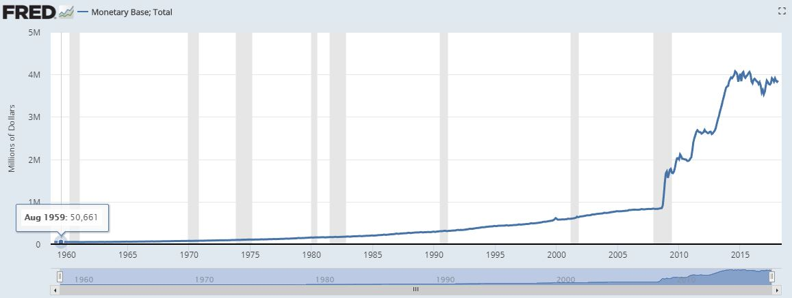

내부 시스템이야 어쨋든 한 사회가 유동성이나 보증적으로 안전하다고 판단하는 법정화폐(이하 피아트)가 있다.

이 시장에 큰 충격이 가해 진다.

바로 글로벌 금융위기 이다.
미국의 초대형 모기지론 대부업체들이 파산하면서 시작되어 미국 밖으로 해당 상품에 거액을 투자한 타 국가들에 영향을 미치며 글로벌금융시장을 연쇄적으로 흔들어 버린 사건.
왜 리먼브라더스, 베어스텐스, 메릴리치 같은 초대형 기업이 파산 하게 되었나? 여기서 많은 의문점이 존재하며, 그 귀착지는 금융시장을 장악하고 있는
중앙은행과 기득권 금융세력의 방만하고 기만적인 행위들 이였고 여기서 바로 탈중앙화의 태양이 뜨게 된다.

서브프라임 모기지 때 미 연방준비은행은 엄청난 규모의 달러를 발행하게 된다. 글로벌 기축통화인 달러의 발행으로 타 국가들 역시 환율 유지를 위해 자국화폐를 비율적으로 추가 발행하였다. 이후 화폐의 가치는 추락하고 버블을 가지지만 숨겨 놓게 된다.

추가 발행된 달러는 주식시장으로도 들어 왔다.
이것은 주식의 버블인가? 화폐의 버블인가? 아마 화폐의 버블일 거라 생각 한다.

        금값은 전고점을 기록했다.
        (이론적으로 금값은 오르는게 아니라, 표시화폐인 달러의 가치가 떨어진다고 봐야한다)

미국은 2008년 서브프라임 이후로 대놓고 강한 달러를 포기,
엄청난 달러를 찍어냈다. (72년 달러가 등장한 이후 최고로 많이)
달러를 찍어낸만큼 미국은 시뇨리지 차익을 얻고,
늘어나는 달러를 시중에 유통시키고 미국의 무역상대국은 이 쓸모없어지는 달러를 곶간에 쌓아두고 있다.

중국과 유럽 일본은 기껏 달러 외화고를 쌓았더니,
미국이 돈을 찍어내니 찍어낸 만큼 실제의 자산 가치는 떨어진다.
중국 입장에선 얼마나 열받을까?
(그런데 한국은 중간에 꼈다, 두놈이 같이 망하지만 않으면 한국경제는 그래도 버틸만할 것이다)

그런데 그만큼 미국의 금리인상과, 임금인상은 이루어지지 않다가
이제야 달러의 기축통화 위상이 의심받자 부랴부랴 금리인상과, 대출 규제, 임금인상이 이루어지는 모습이다, 버블 꺼졌을 때의 충격을 완화하기 위해서.

현재의 명목화폐의 기축인 달러로 코인을 산다는 것은,
블록체인 시장이 CME 선물상장 이상의 의미와 함께, 기성경제에 편입하는 것을 시사한다.
그리고 더불어, 비트코인이 달러의 대체제로써 충분히 달러를 위협하고 있는 것을
미국이 인정하게 되는 꼴이다. 비트코인이 왕노릇하는게 마음에 안드는 것이다.

비트코인이 블록체인이라는 Next Big Market의 제왕이 되려하니,
서둘러 막는 꼴이라니.

비트코인이 나온 시점이 2009년이다. 글로벌 금융위기 직후 미국이 금융위기의 근원지인데 미국은 기축통화국이기 때문에 무제한적 양적완화로 위기를 극복했다. 1997년 아시아 등 기축통화를 갖지 못한 나라들과는 차원이 다르다. 그래서 제3의 통화가 필요하다는 생각이 나오는 것이다. 비트코인은 과학자들이 기술혁신을 통해 제3의 통화를 만들어내려 했던 것이다.

자유주의자들은 신뢰가 불가능한 중앙 권력에 의해 좌지우지 되지 않은 화폐를 꿈꾸게 된다.
"Peer to Peer Eletronic Cash System" 이 등장했다. 법정화폐 대신 피어들간에 가치를 인정하고 통화로써의 역활을 수행할수 있는 전자화폐.
밑바탕에 탈중앙화와 이 시스템의 신뢰를 유지 하기 위한 분산장부 시스템을 운영하기 위한 기술적 난제의 해결 방법들이 있었다.
비잔틴 장군... 장부의 보안... 시스템 참여자들에게 보상을...

법정화폐를 대체 하기 위한 비트코인 암호화폐...
이 시스템을 등에 엎고 기존 시스템을 탈중앙화 하기 위한 많은 암호화폐들과
이렇게 나온 수많은 암호화폐들의 거래 방식이 점점 개선되어 글로벌 선물시스템화 되게 된다.
글로벌 유동성을 가지게된 시스템에 진입하고자 부동자산을 유동화 시키는 많은 아이디어 도 시장에 참여 하게 된다.

crypto currency 는 currency 때문에 화폐로 불리기도 하고 asset 이라고 불리기도 한다.
비트코인은 화폐 역할을 하기 위해 태어났고 지불수단으로써 많은 실험을 거치게 된다. 하지만 높은 변동성이 있어 한 사회에서 화폐로 사용하기에는 문제점이 나타나게 된다.
그리곤 어디선가 비트코인은 달러가 아니라 금, 즉 자산 이라고 보는게 맞다고 한다.
비트코인과 같이 화폐의 역활을 하기 위해 나온 암호화폐는 궁극적으로 화폐를 대체하고 싶어 한다.
하지만 암호화폐의 큰 비중이 Cash 대체가 아니라. 탈중앙화 된 시스템에 집중을 한다. 이것은 선물 가치로써 주식에 해당한다고 볼 수 있다.

태생이 다르긴 하지만 주식은 자산으로 인식하는 편이다.
제한없이 24시간 유동성이 부여 되었을때 이 자산을 커피를 마시고나 식사 등의 비용으로 사용이 가능 할까?
비트코인도 마찬가지다. 투자상품으로 변동성을 감안하고 그러한 용도로 사용이 가능할까?

내 자산의 100% 가 비트코인으로 있고 한 2배쯤 가치가 오른 상태라면 변동성을 감안하더라도 손해 볼건 없을 것이다. 아주 이상적인 그림이 되겠다.

암호화폐 시장은 엄청난 유동성을 가지게 되었다.
변동성을 감안하지 않고 기존의 생각을 깬다면 지불수단으로서 사용가능한 기초 토대는 마련했다고 할수 있다. 물론 생태계의 보안이 없이는 보급은 어려울 것이다. 이를테면 기존 사회 구성원들이 원하는 법정화폐로의 즉시청산 같은 문제 말이다.

생각의 방향은 이렇다.

암호 화폐는 자산이다.
뒷받침 되는 유동성으로 지불수단으로 사용하려는 많은 시도들이 있긴 하다. 비트코인, 이더리움, 라이트코인, 피벡스 등 몇몇 코인에 대해서는 괜찮다고 보지만 대 다수의 코인에 대해서는 비관적이다. 물론 개중에는 화폐를 대체 해야만 살아 남는 녀석도 볼 수 있을 것이다.

하지만 약간만 비틀어서 보면 지불수단으로서의 사용은 시장에 건강한 유동성을 부여하는 하나의 방법으로 인식 할 수도 있을 것이다.

글로벌한 자산 중 하나인 "금" 이 있다.
많은 보유자들이 실물로도 보관하고 "증서" 로 써도 보관할 것이다.
실물과 증서에 상관없이 과한 유동성을 가지게 되었을 때 과연 보유자들은 일반 화폐 처럼 "소비"를 할 것인가?
같은 선상에 보서 봐야 할것 이다. 패러다임의 변화 없이는 불가능해 보인다.

하지만 국제 거래에 있어서라면 이 문제는 어떻게 될 것인가?

패러다임이 변하기 위해서 많은 요소들이 필요 할 것이다.
"변화" "베네핏" "확장" 등

## 암화화폐의 증권여부
[시리어스] [오후 2:48] SEC 기업금융팀 윌리엄 힌만 디렉터의 2018년 6월 14일 발표문. 힌만의 이 발표를 통해 SEC는 ICO를 통해 판매된 암호화폐가 증권인지 아닌지, 이더리움이 증권인지 아닌지를 처음으로 공식 발표했다. 암호화폐 관련 일을 하고 있다면 정독을 권한다.

한편 코인베이스 대표는 리플이 아니라 이더리움 클래식을 자사 거래소에 상장한 이유는 탈중앙화라고 밝혔다. 점점 중앙화되어가는 암호화폐가 정부조직과 중앙화 거래소에 의해 탈중앙화라는 본질로 되돌아 가지 않을까. 역설적이게도.

블록체인 3.0은 TPS와 같은 기술적인 문제들이 아니다. 기술은 1.0, 2.0, 3.0 모두 해결해야 할 공통의 문제들이다. 암호화폐의 세대를 구분하는건 언제나 그렇듯이 어떤 영역에서 탈중앙화를 했느냐이다.

나는 블록체인 3.0은 거버넌스에서의 탈중앙화라고 생각한다. (1) 온체인 거버넌스에서 탈중앙화. 어떤 사람이든지 체인의 개선안을 제안할 수 있고, 토큰 보유자들이 그 안을 채택할지 말지를 온체인에서 결정한다. (2) 오프체인 거버넌스에서 탈중앙화; 토큰 발행회사나 소수의 promoters에 의한 경영 활동으로 토큰 가치가 올라간다는 기대를 하는게 아니라, 토큰 보유자들이, 토큰 커뮤니티의 독립적인 활동으로 토큰 가치가 올라간다. 노상규 교수님과 윤지영 박사님이 말하는 ‘조직없는 조직화’다.

(힌만의 발표문이 길어서 요약하면)
1. 모든 토큰(이든 코인이든 뭐라 부르든)은 그 자체는 증권이 아니다. 2. ICO와 같은 토큰 판매 방식과 수익에 대한 기대 때문에 토큰은 증권으로 분류될 수 있다. 3. 시간이 지나면서 증권이었던 토큰이 증권이 아닌 것으로 바뀔 수 있다. 4. 네트워크가 탈중앙화되어 있다면, 즉 제3자의 경영 활동에 의한 수익을 기대하는게 아니라면, 그 토큰은 증권이 아니다. 4. 따라서 이더리움은 ICO 당시엔 증권이었지만, 지금은 증권이 아니다.
https://www.sec.gov/news/speech/speech-hinman-061418

동영상
money as debt
https://www.youtube.com/watch?v=Sj40eWKu-FY&feature=youtu.be&list=PLFeOWNPl8ro-NNv2LCKHxtjCRnZBK5yUG

신생거래소.

거래소는 600만원정도 받나보네요 그럼
네. 물론 훨씬 더 적게 받는것도 많습니다. (100 이하)

HSM 이 hash 를 private key 로 signature 만드는 역활을 하는데, 이걸 개인이 local 에서 수행하도록 하면 HSM 하고 다를바가 없겠죠..

트랜젝션을 lcoal pc(public 망하고 연결이 안된) 로 던저서 hashed operation 으로 return 해주는 기능이니까 tezos 쪽에서도 충분히 만들수있을것 같네요. 

테조스의 accounting model은 비트코인의 utxo가 아니고 이더의 account based 입니다.
기본적으로 모든 pos는 follow-the-satoshi 라는 알고리즘을 따르는데요

가장 단순한 모델은 새롭게 발행(코인베이스 Tx, minting 등 어떤 용어든 네트워크 내에서 새롭게 생기는 걸 말함)되는 코인에 각각 시리얼번호를 부여하고 매 mining(baking 등) 시, 랜덤하게 시리얼 번호를 뽑고, 그 번호에 해당하는 코인을 보유하는 사람이 miner가 되는 겁니다.

이때, follow-the-satoshi 알고리즘과, 랜덤하게 코인을 뽑는 과정이 모델별로 다릅니다.
베이킹 클래스 때 완벽하게 가이드 드릴 겁니다.

현재 포지션 페이버, 화이트 페이퍼, 개발자 문서, 소스코드 내 다큐먼트 분석중이고 알파넷 노드로 시나리오 실험중입니다.
문서간 불일치가 좀 있고, 알파넷 내의 rpc api도 약간 문제가 있어서 
지금 헷갈리는 부분이 일부 있는데

